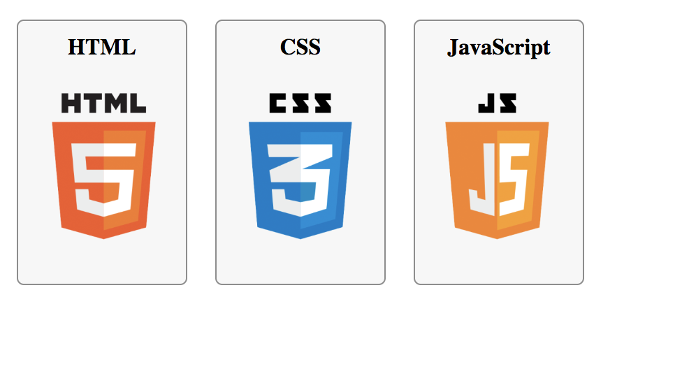
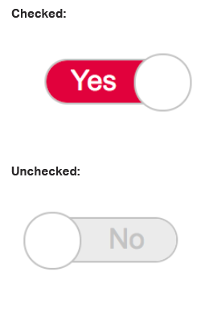

# Fun with CSS

## Introduction

This project is all about experimenting and creating fun layouts using only HTML and CSS. No JavaScript is involved, pushing the boundaries of what can be achieved with pure CSS. Enjoy crafting visually appealing designs and animations as you work through the tasks!

## Table of Contents

- [Tasks](#tasks)
  - [0. Sprite languages](#0-sprite-languages)
  - [1. Move the (under)line](#1-move-the-underline)
  - [2. Toggle](#2-toggle)
  - [3. Menu](#3-menu)
- [Repository](#repository)

## Tasks

### 0. Sprite languages

Create a CSS file (`0-styles.css`) that styles the provided HTML to generate a layout using the sprite image (`0-sprite.png`). You are not allowed to modify the HTML or the image.

**File:** `0-styles.css`

### 1. Move the (under)line

Using the provided HTML, create a CSS file (`1-styles.css`) where the underline for the link is hidden by default and appears slowly when hovered. The HTML must not be altered.

**File:** `1-styles.css`

### 2. Toggle

Develop a custom toggle switch layout using CSS only. The provided HTML must not be changed. Your task is to style the checkbox input into a toggle switch.

**File:** `2-styles.css`

### 3. Menu

Design a CSS layout/animation for a menu using the provided HTML. You are not allowed to modify the HTML. Implement a stylish and functional menu.

**File:** `3-styles.css`

## Repository

All your work should be committed to the following repository:

- **GitHub repository:** `holbertonschool-Fun-with-CSS`

Enjoy experimenting with CSS and creating these fun layouts!
